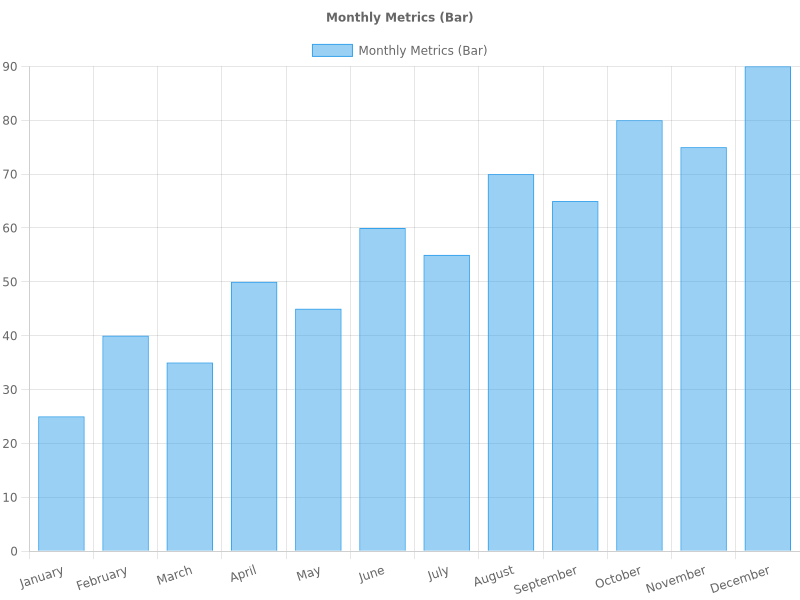
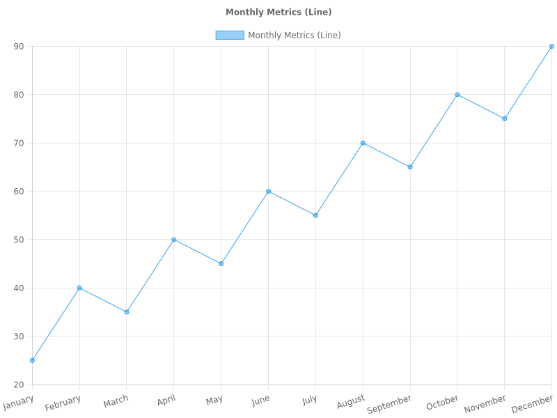
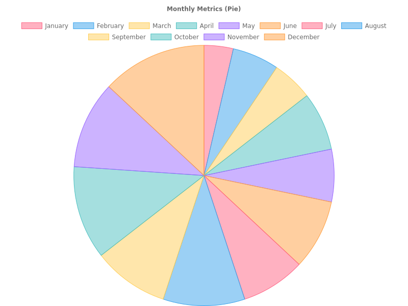
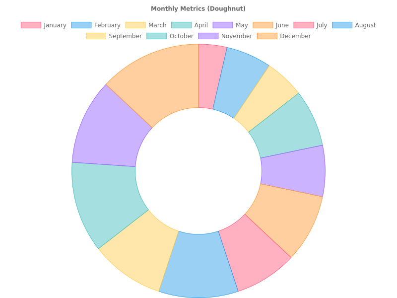
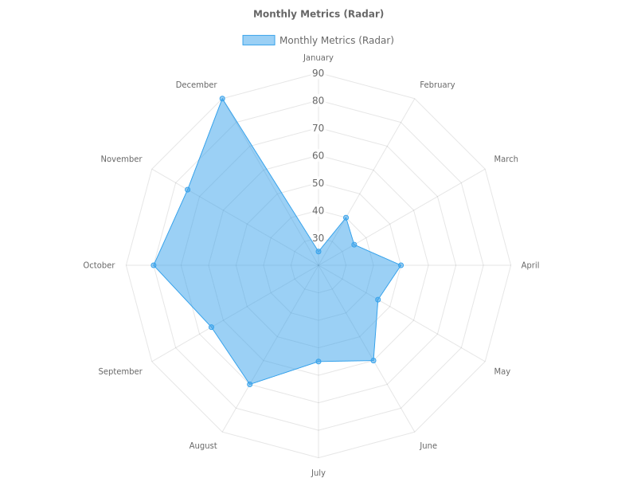
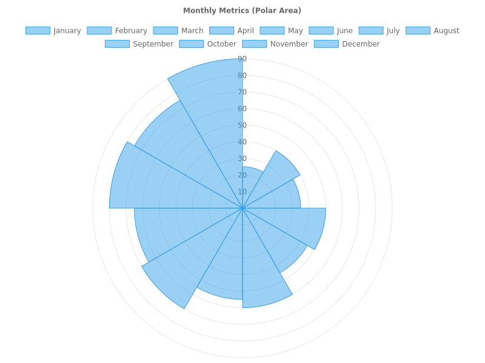

[](https://github.com/asabon/csv-graph-generator/actions/workflows/test-action.yml)

# CSV Graph Generator (日本語)

[English](./README.md)


CSVファイルからグラフ画像を自動生成する GitHub Action です。入力されたCSVデータを解析し、Chart.js を使用して視覚化（棒グラフや折れ線グラフなど）を行い、画像ファイルとして保存します。IssueコメントやPull Requestの説明、レポートファイルなどに動的なデータ視覚化を含めたい場合に便利です。

## 特徴

*   **CSV解析**: 指定されたCSVファイルからデータを読み込みます。
*   **グラフ生成**: Chart.js を使用して、様々な種類のグラフ（棒グラフ、折れ線グラフなど）を生成します。
*   **カスタマイズ可能**: 出力ファイルパス、グラフの種類、タイトルなどを設定できます。
*   **簡単な統合**: 任意の GitHub Actions ワークフローに簡単に追加できます。

### 出力サンプル

このアクションで生成されたグラフの例です：

**棒グラフ (Bar Chart)**
<p></p>

**折れ線グラフ (Line Chart)**
<p></p>

**円グラフ (Pie Chart)**
<p></p>

**ドーナツグラフ (Doughnut Chart)**
<p></p>

**レーダーチャート (Radar Chart)**
<p></p>

**鶏頭図 (Polar Area Chart)**
<p></p>

## 使い方

ワークフロー設定ファイル（例: `.github/workflows/generate-graph.yml`）に以下のステップを追加してください。

```yaml
steps:
  - name: Generate Graph from CSV
    uses: asabon/csv-graph-generator@v0
    with:
      csv-file: 'data/metrics.csv'
      output-file: 'report/graph.png'
      graph-type: 'bar'
      title: 'Monthly Metrics'
```

### 入力パラメータ

| 入力名 | 説明 | 必須 | デフォルト値 |
| :--- | :--- | :---: | :--- |
| `csv-file` | 入力CSVファイルのパス。 | **はい** | N/A |
| `output-file` | 出力画像の保存先パス。 | **はい** | `graph.png` |
| `graph-type` | 生成するグラフの種類 (`bar`, `line`, `pie`, `doughnut`, `radar`, `polarArea`)。 | いいえ | `bar` |
| `title` | 表示するグラフのタイトル。 | いいえ | `''` |

### CSVフォーマット例

このアクションは、1行目がヘッダーである単純なCSVフォーマットを想定しています。デフォルトでは、**1列目がラベル（X軸）**、**2列目がデータ値（Y軸）** として使用されます。

```csv
Label,Value
January,10
February,20
March,15
April,25
```

## 貢献について

貢献を歓迎します！このプロジェクトへの貢献方法の詳細については、[CONTRIBUTING_ja.md](./CONTRIBUTING_ja.md) をご覧ください。

## ライセンス

このプロジェクトは MIT ライセンスの下でライセンスされています。詳細については [LICENSE](./LICENSE) ファイルをご覧ください。
